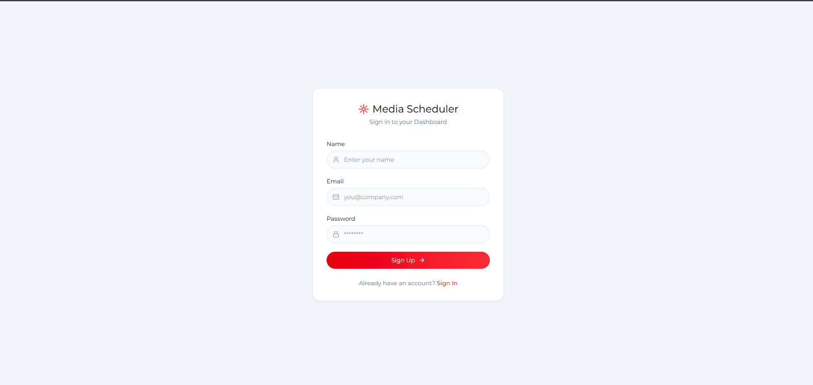
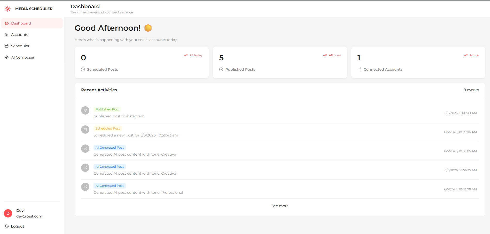
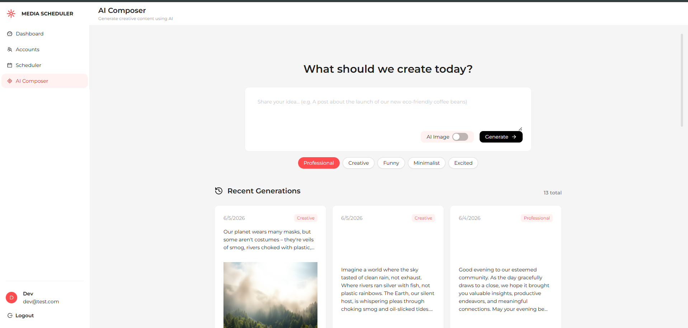
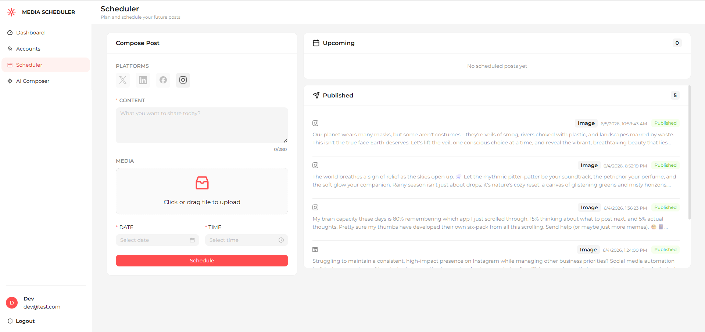
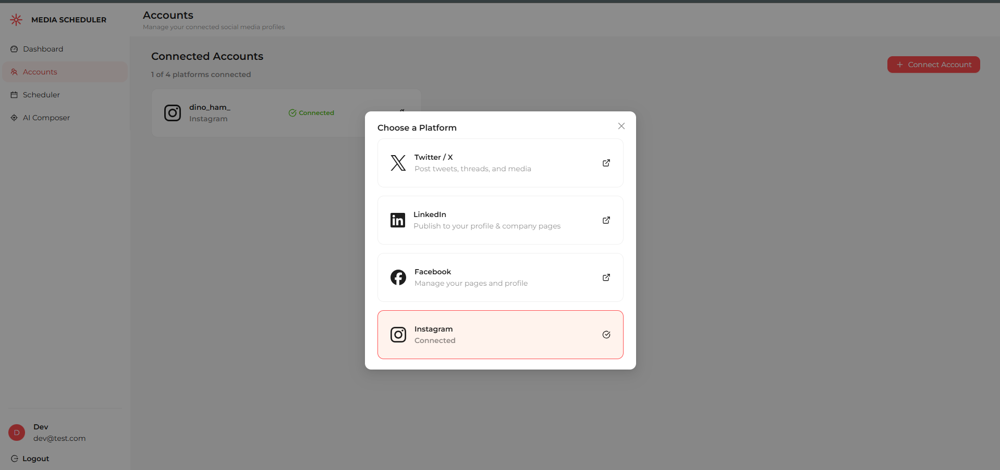
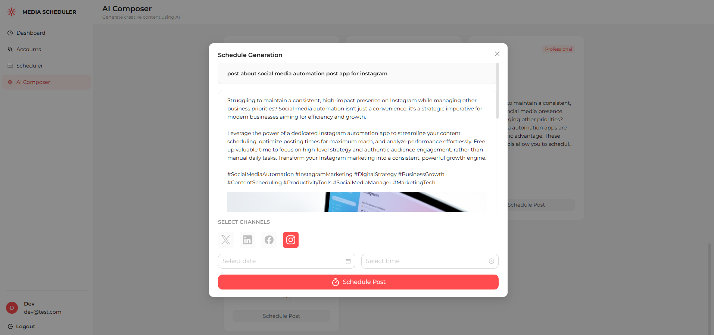
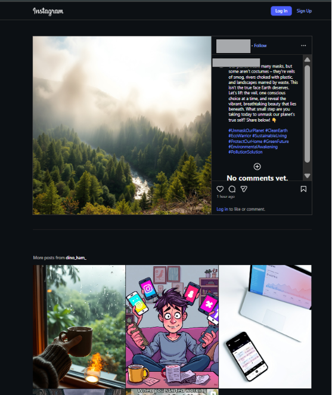
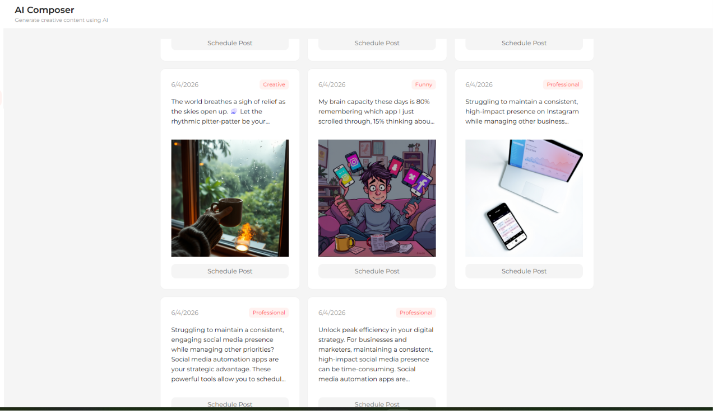
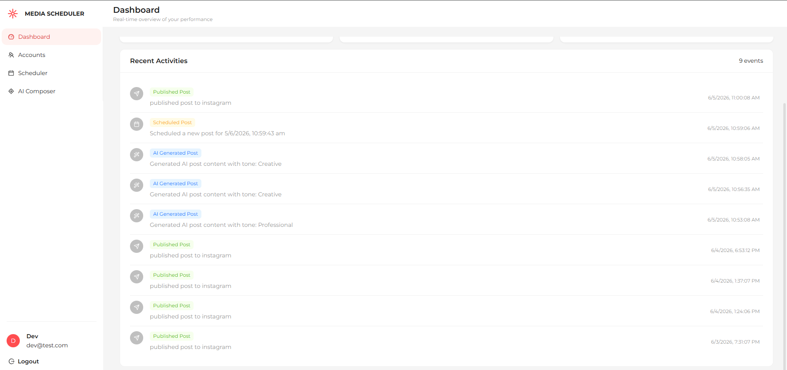

# Medial Scheduler: AI-Driven Multi-Platform Automation

#### **Medial Scheduler** is a sophisticated social media management engine designed to bridge the gap between creative ideation and multi-channel distribution. By integrating state-of-the-art LLMs with automated scheduling services, it enables users to maintain a 24/7 digital presence with minimal manual overhead.

## 🎯 The Purpose & Concept

Managing a digital presence across multiple channels is often a fragmented and time-consuming process. Creators often find themselves jumping between tabs to draft copy, find or generate images, and manually post to each platform.

**SocialFlow** solves this by consolidating the entire lifecycle into a single, intelligent pipeline. It is built to:

1. **Eliminate Creative Block**: Use AI to draft posts and generate unique visuals on demand.
2. **Automate Consistency**: Schedule content once and let the system handle the API handshakes across X, LinkedIn, Facebook, and Instagram.
3. **Centralize Operations**: Monitor all brand activity from one unified dashboard.

---

## ️ System Architecture

The application follows a modular **Client-Server-Service** architecture designed for high availability and task decoupling:

1.  **Orchestration Layer (Backend)**: An Express/Node.js API that manages authentication, asset storage via Cloudinary, and complex post-state transitions (Generated -> Scheduled -> Published).
2.  **Intelligence Layer (AI)**: Dual-integration using **Google Gemini** for context-aware copywriting and **Hugging Face (FLUX models)** for high-fidelity image generation based on AI-suggested prompts.
3.  **Execution Layer (Worker)**: A resilient background service utilizing `node-cron` to monitor the MongoDB pipeline and trigger multi-platform distribution through the **Zernio API**.
4.  **Presentation Layer (Frontend)**: A responsive React SPA built with TypeScript and Ant Design, providing real-time activity feeds and complex form management for post composition.

---

## 🌟 Key Modules & Logic

## 🖥️ Frontend Page Breakdown & Functionality

### 1. Authentication (Login/Register)

The gateway to your personalized automation suite.

- **Functionality**: Secure JWT-based entry. Users can toggle between Sign In and Sign Up.
- **UI Highlight**: Features a minimalist, high-contrast design using the Montserrat font for a professional "SaaS" feel.
  

### 2. The Command Center (Dashboard)

Provides a holistic, bird's-eye view of your social presence.

- **Real-time Metrics**: Quick-glance cards showing counts for Pending Schedules, Total Publications, and Active Connections.
- **Activity Feed (ListData)**: A color-coded audit trail of system events. Green for published, Blue for AI generations, and Yellow for upcoming schedules.
- **Dynamic Greetings**: A contextual header that greets the user based on their local time (Morning/Afternoon/Evening).
  

### 3. Intelligence Hub (AI Composer)

Where ideas turn into digital assets.

- **Prompt Input**: Describe your post topic and select a tone (e.g., Professional, Creative, Casual).
- **Visual Synthesis**: A toggle to generate high-fidelity AI images via FLUX models. The system automatically handles the prompt engineering for the visual based on your text content.
- **History Feed**: Browse through all previous AI generations, allowing you to re-schedule or refine old ideas.
- **AI-Driven Instagram Integration**: Seamlessly publish AI-generated visuals directly to Instagram, satisfying the platform's media-first requirements automatically.
  

### 4. Execution Engine (Scheduler)

Complete control over your publication timeline.

- **Advanced Composition**: Manually draft content, upload your own media, and select specific platforms.
- **Platform Guardrails**: The UI dynamically detects which accounts you've connected. Unconnected platforms are disabled (grayscale) to prevent errors.
- **Timeline Split**: Separate views for "Upcoming" (queued content) and "Published" (historical archives).
  

### 5. Integration Manager (Account Management)

The bridge to the social world.

- **OAuth Connectivity**: Link your X (Twitter), LinkedIn, Facebook, and Instagram accounts.
- **Connection Status**: Real-time health checks on your social tokens to ensure automation never fails.
  

---

## 🔄 The SocialFlow User Journey

1.  **Onboarding**: Log in and visit the **Accounts** page to securely link your social profiles via Zernio.
2.  **Ideation**: Use the **AI Composer** to turn a simple thought into a ready-to-post draft with a matching AI image.
3.  **Refinement**: Review the generation, then click "Schedule" to open the platform selection modal.
4.  **Queueing**: Pick your peak audience time and select the target platforms. Your post enters the "Upcoming" queue.
5.  **Execution**: SocialFlow's background worker (`node-cron`) handles the automated API handshakes and asset distribution (including media-heavy Instagram posts) at the scheduled time.
6.  **Monitoring**: Visit the **Dashboard** to see your successful publications and system events appear in the Activity Log.

---

---

## 🛠️ Tech Stack Highlights

- **Frontend**: React 19, TypeScript, Ant Design, Lucide Icons, SCSS Modules.
- **Backend**: Node.js, Express, MongoDB (Mongoose), Node-Cron.
- **Intelligence**: Google Gemini AI (LLM), Hugging Face Inference (FLUX).
- **Cloud Services**: Cloudinary (Media), Zernio (Social API Gateway).

---

## 🛠️ Technical Deep Dive

### Why this Stack?

- **Gemini 1.5 Flash**: Chosen for its high context window and speed, allowing for nearly instant post generation.
- **Zernio API**: Acts as a robust abstraction layer for social media APIs, handling OAuth complexities and rate limits.
- **Cloudinary**: Ensures that AI-generated assets are served via a fast CDN rather than being stored on the primary server, optimizing load times.
- **Ant Design**: Provides a consistent, enterprise-grade UI library that handles complex form states and modals out of the box.

---

## 📱 UI Showcase

### Intelligent Post Composer

The composer features a platform-first design, allowing users to toggle between accounts while receiving real-time character count feedback and media previews.

### AI-Synthesized Instagram Post

SocialFlow automates the entire Instagram workflow. Below is an example of a post where the AI drafted the caption, added trending hashtags, and generated a high-fidelity visual asset that was automatically published to the user's feed.

### Multi-Channel Scheduling

A split-view scheduler allows for the management of upcoming content while providing a scrollable history of previously published posts.

### Comprehensive Activity Logs

Every action taken by the AI or the user is recorded with unique visual identifiers, allowing for easy troubleshooting and performance tracking.

## 🔮 Future Roadmap

### 📊 Analytics & Insights (Planned)

- **Edit Post**: A feature to modify content or rescheduling times for posts still in the "Upcoming" queue.
- **Cancel & Delete**: One-click removal of scheduled posts to stop them before they go live.
- **Historical Cleanup**: Ability for users to prune their "Published" history to keep their workspace tidy.

---

_This project represents a full-stack journey into modern automation, focusing on the intersection of user experience and background process reliability._
